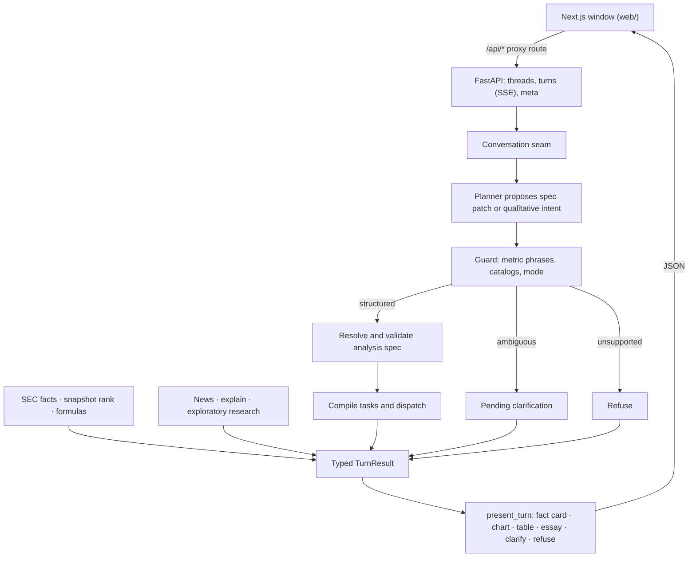

# Onfile

[](https://github.com/bpyman/onfile/actions/workflows/ci.yml)
[](https://www.python.org/downloads/)
[](web/README.md)
[](https://onfile-analyst.vercel.app)

**Explore company financials, straight from SEC filings.**

Ask about a company and get the number and the filing behind it. Onfile is an evidence-first research agent. A planner reads the question, rules first and a language model where the rules are unsure; deterministic code owns every number: the quarterly facts, the arithmetic, the rankings, and the values on screen. Click any figure, in a table or on a chart, to see the exact amount, CIK, accession, XBRL concept, and a link to the filing it came from.

<p align="center">
  <a href="https://onfile-analyst.vercel.app"><strong>Try the live demo</strong></a> ·
  <a href="#run-it-locally">Run it locally</a> ·
  <a href="docs/design.md">Design</a> ·
  <a href="docs/adr/">ADRs</a>
</p>


<sub>"Compare Eli Lilly and Pfizer revenue over the last eight quarters", on the public demo. Fiscal fourth quarters are derived from the 10-K and marked †.</sub>

**Results**
- **Planners, on 66 held-out conversations:** rules planner 85%, LLM planner 88%, and a rules-first cascade 88% at a fifth of the LLM's cost ([comparison](docs/evaluation/planner-comparison.md)).
- **Within noise, so decided on cost:** the LLM passed 2 cases the rules planner missed and none the other way (p = 0.50). The live demo runs the cascade ([ADR 0012](docs/adr/0012-the-live-planner-is-a-rules-first-cascade.md)).
- **Figures checked against their filings:** 25 of 25 found in the text of the 10-Q they cite ([filing check](docs/evaluation/filing-check.md)).
- **What did not work, and what changed:** [retired approaches, wrong numbers, and a held-out set I had read](#what-failed-and-what-i-changed).

## How it works

The planner proposes; code owns every number.

1. **SEC quarterly facts, with provenance.** Standalone 10-Q amounts from companyfacts XBRL, each with its accession, period, concept, and an EDGAR filing link.
2. **Constrained planning.** The planner (rules first, a language model where the rules are unsure) proposes a typed analysis-spec patch; code resolves CIKs, catalog metrics, and period windows. It does not chain tools or invent constituents.
3. **Answers the model cannot rewrite.** Tables and charts render from tool output. Essays pass a numeral lock. Ambiguous metrics get a clarifying question; unknown scope is refused.
4. **Follow-ups edit the analysis.** `add Apple`, `show year-over-year` or `make that the last four quarters` patches the spec on screen instead of starting over; each chip above the conversation can be removed or added to.
5. **Like-for-like comparisons.** Year-over-year change reads the prior quarter as the current filing restates it, so stock splits and restatements don't distort growth ([ADR 0009](docs/adr/0009-year-over-year-reads-the-comparative.md)). Ratios on a negative base (return on negative equity, a margin on negative revenue) say "Not meaningful" instead of printing a number.
6. **Degrades instead of failing.** Every SEC request has a deadline and every turn a budget; a company whose data fails gets its own "Source unavailable" row while the rest of a ranking or comparison answers; bad documents are never cached; SEC's rate limits are honoured. The app was red-teamed across its API, planner, numbers, window and failure modes.

## What it can answer

| Ask about | For example |
|---|---|
| Quarterly figures | revenue, net income, operating and gross margin, EPS, R&D, cash flow, cash, equity, dividends |
| Derived figures | EBITDA, return on equity, P/E, share price ([ADR 0008](docs/adr/0008-balance-sheet-trailing-year-and-market-figures.md)) |
| Comparisons and trends | `Compare Eli Lilly and Pfizer revenue over the last eight quarters` |
| Growth and overviews | `Compare Microsoft and Apple revenue growth` charts the growth rates; `How is Nvidia doing?` answers in a sentence with recent quarters |
| Rankings | `Top 10 technology companies by net margin`, over a dated snapshot of about 5,200 US operating companies |
| Filing changes | `What changed in Microsoft's latest 10-Q?`, a paragraph diff of MD&A and Risk Factors with the changed words marked |
| Context | recent news and a short explanation, kept apart from the numbers |

### How a question is read

What a question leaves out has a default, so the same words always get the same answer:

| You ask | You get |
|---|---|
| No period: `Apple revenue` | The latest quarter. |
| A window: `last 3 quarters`, `past two years`, `18 months`, `the past decade`, `since 2024` | That many recent quarters (`since 2024`: every quarter since), at most 40. A year is 4 quarters, a decade 40, and months are a third, rounded up; `the past year`, `a few` and `several` are 4, and `a couple of` is 2. |
| Trailing twelve months: `TTM net income`, `LTM net income`, `trailing twelve month net income` | One amount: net income over the four quarters to the latest report, the 10-K's year or derived from it and the year to date (ADR 0008). A figure with no trailing-year form (`TTM revenue`) shows its latest 4 quarters. |
| A named period: `Q2 2025`, `fiscal 2025` | That quarter or year on each company's own fiscal calendar; `calendar Q2 2025` for the calendar quarter. |
| Growth with no period: `How fast is Apple's revenue growing?` | The latest 5 quarters, each with its year-over-year change. |
| Year over year with no period: `Apple revenue year over year`, `versus the same quarter last year`, `up from a year earlier` | The latest 8 quarters, each with its year-over-year change. After a question about several quarters, `show that year over year` keeps those quarters. |
| Quarter over quarter: `quarter over quarter`, `sequentially` | The latest 5 quarters, each with its change on the quarter before. |
| A change with no base: `Why did revenue drop?`, `How much did revenue change?`, `What drove the change in revenue?` | A question: compared with what? |
| An ambiguous word: `profit`, `income`, `margin`, `cash flow`, `interest`, `expenses`, `dividends` | A question: which one? (ADR 0004). `earnings` is net income. |
| Two metrics: `revenue and net income` | Both. |
| `How is Apple doing?` | An overview: revenue, net income and three margins for the latest quarter, with five quarters of revenue and net margin. |
| A ranking: `top banks by revenue`, `biggest tech companies` | The top 10. With a metric, each company's figure for its latest quarter, ordered by it when asked `by` it (`top 5 banks by net income`) and by market value when asked `and their` (`top 5 banks and their net income`); with no metric, by market value. |
| A follow-up: `add Microsoft`, `also Microsoft`, `Microsoft too` | The companies on screen plus Microsoft, same metric and window. |
| A follow-up: `what about Microsoft?`, `same for Microsoft` | Microsoft in place of the companies on screen, same metric and window. `drop`, `remove`, `take out`, `without`, `swap X for Y` and `make it the last 8 quarters` edit what is on screen. |
| A filing change with nothing named: `What changed in Microsoft's latest 10-Q?` | The latest 10-Q against the one a year earlier, Management's Discussion and Analysis and Risk Factors. `10-K` or `annual report` compares 10-Ks. |

Every answer can be checked and taken away: click a figure for its source, sort any column (the chart follows), copy it as Markdown with its sources, download the table as CSV, or copy a link that asks the same question. Comparisons over time read as quarters × companies, and a fact card shows its year-over-year and quarter-over-quarter change. Press `/` to ask and ↑ to recall the last question.

<table>
  <tr>
    <td width="50%"></td>
    <td width="50%"></td>
  </tr>
  <tr>
    <td><sub>What changed in the latest 10-Q: a deterministic paragraph diff, with the words that changed marked.</sub></td>
    <td><sub>Every value opens to its exact source: amount, CIK, accession, concept, and filing.</sub></td>
  </tr>
  <tr>
    <td width="50%"></td>
    <td width="50%"></td>
  </tr>
  <tr>
    <td><sub>A company overview answers in a sentence, then shows its recent quarters.</sub></td>
    <td><sub>Sort any table column; the chart's bars follow the table.</sub></td>
  </tr>
</table>

## Try it

Hosted demo (opens on the live runtime, straight from SEC EDGAR; switch to Recorded for the captured filings): [onfile-analyst.vercel.app](https://onfile-analyst.vercel.app). While the API wakes from sleep, the guided stories answer at once from the recorded runtime, marked "Demo data". The window also installs as a desktop app from the browser. Or [run it locally](#run-it-locally) in two commands.


[Walkthrough video](docs/portfolio/images/demo-walkthrough.mp4): Eli Lilly, Pfizer and Merck revenue over eight quarters, the follow-up `show year-over-year` redrawing it as growth rates, then the exact 10-Q source behind a Lilly value.


The images are captured from the window by a Playwright script against the recorded runtime, so they can be regenerated whenever the window changes (see [Portfolio images](#portfolio-images)).

## Evaluation

| What | Result | How it was measured |
| --- | --- | --- |
| [Planner comparison](docs/evaluation/planner-comparison.md) | Held out: rules planner 85%, LLM planner 88%, cascade 88% (p = 0.50) | 66 conversations written from a brief frozen first, run end to end on the recorded runtime with only the planner swapped |
| [Filing check](docs/evaluation/filing-check.md) | 25 of 25 figures found in the filing's own text | Figures the live window shows, across sectors and metrics, looked up in the 10-Q each cites |
| [Numeral lock](docs/evaluation/numeral-lock.md) | Withholds every changed or invented number, passes every true figure as shown or rounded | Known sentences over ten recorded answers' grounding; no model |
| [Phrase coverage](docs/evaluation/phrase-coverage.md) | 271 of 273 everyday phrasings of metrics, windows, changes and follow-ups read as [the defaults](#how-a-question-is-read) say | Each asked as a whole question on the recorded runtime; a test fails on any new misreading |
| [Company name coverage](docs/evaluation/company-coverage.md) | 98.7–98.8% of 5,161 companies found for each name form, 100% as `$TICKER` | Every snapshot company asked about in six forms of its name |
| [Scorecard](docs/evaluation/scorecard.md) | 30 recorded-runtime cases, with p50/p95 latency | Lookups, calendars and derived quarters, growth, rankings, refusals, clarification, follow-ups, filing changes, the numeral lock |

**Which planner, and why.** The live demo plans every turn with the rules planner, and asks the LLM planner only where the rules planner's plan shows it was unsure: about one planner call in five on the held-out set. On those 66 conversations the cascade matched the LLM planner case for case, at $0.0007 a planner call against $0.0033, and with a median planner time of 1 ms against 1.3 s. The LLM planner's lead over the rules planner alone, two cases, is within noise ([ADR 0012](docs/adr/0012-the-live-planner-is-a-rules-first-cascade.md)).

**How the held-out set was kept honest.** Its brief was committed before any case existed. A separate Claude session wrote and labelled the 66 cases from it, reading only the README, the glossary and three ADRs. The cases were committed before any planner ran, and the cascade and the significance test were committed before the run. Earlier sets were each held out once and then read or tuned on; the [protocol](docs/evaluation/planner-comparison.md#protocol) says what happened to each. The eight cases every planner failed were not planning errors: six are defects in the code all planners share, and two are labels that disagree with a design decision ([findings](docs/evaluation/held-out-4-findings.md)).

**The numeral lock's limits.** It checks numbers, not meaning: a true figure given to the wrong company passes, and so does a number written in words. It catches every changed or invented digit.

### Running the evaluations

The offline suite is the default CI gate. It runs on the recorded runtime and the rules planner, so it needs no keys and can pin exact figures ([ADR 0011](docs/adr/0011-the-rules-planner-is-the-keyless-planner.md)):

```text
uv run python -m pytest -q
uv run python -m financial_analyst_agent.evaluation            # the scorecard
uv run python -m financial_analyst_agent.numeral_lock_evaluation
uv run python scripts/check_against_filings.py                 # live: reads about 25 filings from SEC
```

Live network tests need keys:

```text
uv run python -m pytest tests/integration/test_live_openai_planner.py -m network
uv run python -m pytest tests/integration/test_live_sec_lookup.py -m network
uv run python -m pytest tests/integration/test_live_tavily_news.py -m network
```

The planner comparison is free for the rules planner. The LLM planner and the cascade call OpenAI, so they take prices and one budget for both:

```text
uv run python -m financial_analyst_agent.planner_evaluation                       # rules planner, free
uv run python -m financial_analyst_agent.planner_evaluation --estimate --runs 3   # tokens for an LLM run
uv run python -m financial_analyst_agent.planner_evaluation --planners rules,llm,cascade \
    --runs 3 --paid-split held_out --input-price <usd per 1M> --output-price <usd per 1M> \
    --budget-usd <cap>
```

## What failed and what I changed

Approaches I built, then retired:

- **A Streamlit window.** The first audience window was a Streamlit app. It became a Next.js window over a small FastAPI seam, so every number is still formatted in Python and a thread is bound to one runtime. [ADR 0006](docs/adr/0006-react-audience-window.md), [#4](https://github.com/bpyman/onfile/pull/4), [#6](https://github.com/bpyman/onfile/pull/6).
- **A lock on year-to-date subtraction.** ADR 0003 forbade deriving any quarter, so every multi-quarter window skipped fiscal fourth quarters and cash flow could not be offered at all. It became two labelled derivations: the 10-K's year minus the nine months, and a year-to-date difference. Each is marked derived and keeps both filings as evidence. [ADR 0007](docs/adr/0007-derived-quarters-and-per-share.md), [#16](https://github.com/bpyman/onfile/pull/16).
- **Issuer-name catalogs.** Ranking first excluded funds and acquisition shells by words in their names (`Fund`, `BDC`, `Acquisition`, `Capital Corp`). That missed ordinary-named shells and dropped real operating companies. Membership is now structural (security type, listing title, issuer industry) plus a CIK blocklist, and lookups apply the same rule. [ADR 0001](docs/adr/0001-snapshot-membership.md), [ADR 0002](docs/adr/0002-lookup-membership.md), [`9c8c1f3`](https://github.com/bpyman/onfile/commit/9c8c1f3) replaced by [`1fd4215`](https://github.com/bpyman/onfile/commit/1fd4215).
- **Year over year against the original filing.** A change subtracted the year-earlier quarter as first filed. After NVIDIA's ten-for-one split, its diluted EPS read −87.3% instead of +26.7%. A change now starts from the comparative the newer filing reports on the current basis. [ADR 0009](docs/adr/0009-year-over-year-reads-the-comparative.md), [#48](https://github.com/bpyman/onfile/pull/48).

Bugs the second red-team round found:

- **One busy refund broke every turn.** Refunding a turn turned away as busy left an empty rate-limit record, and from then on every turn, for every visitor, returned 500 until the process restarted. [#45](https://github.com/bpyman/onfile/pull/45).
- **Wrong numbers** ([#48](https://github.com/bpyman/onfile/pull/48)), each checked against SEC company facts or the filing:
  - EPS growth across a stock split showed −87.3% instead of +26.7%.
  - Revenue took one tagged line instead of the total: $25.83M instead of $263.59M for Verra Mobility.
  - Derived fourth quarters ignored nine-month figures the 10-K had revised: Rapid7's net income read −$1.48M instead of +$2.17M.
- **A slow SEC response froze the service.** A response dripping one byte at a time kept a turn open and its thread locked, and four of them made every visitor "busy". A turn now ends with "Source unavailable" and frees its slot. [#47](https://github.com/bpyman/onfile/pull/47).
- **Capitalised words were read as tickers.** "WHAT IS NVIDIA NET MARGIN NOW?" added ServiceNow. Ordinary words and finance acronyms no longer resolve as tickers; real ones like `NOW revenue` still do. [#46](https://github.com/bpyman/onfile/pull/46).

What the planner comparisons found ([ADR 0010](docs/adr/0010-one-reading-of-names-and-windows.md), [ADR 0012](docs/adr/0012-the-live-planner-is-a-rules-first-cascade.md)):

- **An LLM planner on every turn.** The live demo planned every turn with `gpt-5.6-terra`. On a fresh held-out set it was not measurably better than the rules planner (88% against 85%, p = 0.50), so it now plans only where the rules planner is unsure: the same 88%, at a fifth of the cost.

- **Three resolvers for one name.** The rules planner read names with its issuer index, spec resolution used a narrower resolver, and the facts lookup resolved the words again from SEC titles. "Goldman Sachs" from the LLM planner was resolved to GS and then shown as "company not found". Live, "Coca-Cola" came back ambiguous between three bottlers. There is now one reading of a name.
- **A period reader that knew six numbers.** "Past six quarters" and "previous nine quarters" fell back to the latest quarter. One grammar now reads any recency word, count and unit.
- **"Target" the word.** "Nvidia's target margin" added Target. Whether a name is also an everyday word now comes from case in 10-Q text, and the word counts as the company only where the question uses it as one.
- **A held-out set I had read.** My brief asked the first blind labelling session to return its cases, so I saw them while changing the planner. They became development cases, and a second session wrote the held-out set, reporting only counts.

- **A numeral lock that withheld true figures.** It matched digits exactly, and an essay's grounding holds 22974000000, so a true "$22.97 B" or "30.9%" was withheld every time. A number now also passes when it rounds from a grounded value at the precision written; changed and invented numbers are still withheld ([measurement](docs/evaluation/numeral-lock.md)).

As an independent check outside the XBRL data the app reads, [the filing check](docs/evaluation/filing-check.md) opens the 10-Q each figure cites and looks for the number in the filing's own text: **25 of 25** figures were found.

## Architecture

The audience window is a Next.js app. The browser only calls the window's own `/api/*`; a route handler proxies each call to a small FastAPI service (`financial_analyst_agent.api`), so the Python origin is never a second public entry point. The API adds no financial logic: it is a transport over the conversation seam, the thread store, and `present_turn`, which turns a result into display records. Every amount shown as text is formatted in Python, and a turn streams progress over server-sent events. See [ADR 0006](docs/adr/0006-react-audience-window.md).

Behind the seam, a persisted **conversation thread** carries a patchable **analysis spec**. Follow-ups edit companies, metrics, periods, and operations instead of restarting. `run_turn` remains a one-message wrapper over a thread, which the per-intent tests use.



Full design: [`docs/design.md`](docs/design.md). ADRs: [`docs/adr/`](docs/adr/).

## Built with

Python 3.12 (FastAPI, Pydantic, LangGraph, Decimal arithmetic) managed by uv, with the same tools served over MCP · Next.js and React with Recharts · SEC EDGAR companyfacts XBRL and filing text · Financial Modeling Prep for the ranking snapshot · OpenAI for planning and essays in live mode, with a rules planner when no key is set · pytest and Playwright browser checks in GitHub Actions · Vercel and Render.

## Run it locally

The window is a Next.js app (`web/`) that proxies `/api/*` to a Python API ([ADR 0006](docs/adr/0006-react-audience-window.md)). You need [uv](https://docs.astral.sh/uv/) and Node 22 (`.nvmrc`). One-time setup:

```text
uv sync
npm --prefix web install
cp .env.example .env        # Windows: copy .env.example .env
```

`.env.example` sets `APP_MODE=recorded` (`fixture` still works as a deprecated alias), so no keys are needed. Then run the API and the window, each in its own terminal:

```text
uv run serve-api            # the API on http://127.0.0.1:8000
npm --prefix web run dev    # the window on http://localhost:3000
```

Open http://localhost:3000 and click a guided story. [`web/README.md`](web/README.md) lists the window's environment variables, checks, and the browser check.

Beyond the guided stories, try these. Follow-ups such as `add Apple` patch the analysis instead of starting over.

1. What was Microsoft's latest quarterly pretax income?
2. Compare Tesla and GM revenue
3. What are the top 10 tech companies and R&D spend for each?
4. add Apple
5. make that the last four quarters
6. Apple diluted EPS in Q3 FY2025
7. Compare Cisco and Oracle revenue calendar Q2 2026

Named periods ("Q3 2024", "fiscal 2025", "calendar Q2 2026") use each company's own fiscal calendar. A fiscal fourth quarter, which companies report only inside the 10-K, is derived as the year minus the nine months and marked † with both source facts in the evidence; per-share figures are never derived ([ADR 0007](docs/adr/0007-derived-quarters-and-per-share.md)). Cash and equity are balance-sheet amounts at the quarter's end; return on equity and P/E use trailing-year net income; P/E and share price use the snapshot's market data, so P/E is given for the latest period only ([ADR 0008](docs/adr/0008-balance-sheet-trailing-year-and-market-figures.md)).

The recorded runtime replays captured SEC, news, and model responses through the same orchestration and renderer as the live runtime. It proves orchestration, not EDGAR freshness. `APP_MODE=live` with the keys in `.env` runs the live runtime.

## Deploy

The API also ships as a Docker image. It installs from `uv.lock`, runs as a non-root user, listens on `$PORT` (default 8000) on all interfaces, starts on the recorded runtime unless `APP_MODE=live` is set, and has a health check on `/api/health`. The image holds only the installed package: no tests, `web/`, or dev tooling.

```text
docker build -t financial-analyst-api .
docker run --rm -p 8000:8000 financial-analyst-api

# what CI runs: health check, a recorded thread, and the "Verify a quarterly fact" turn
python3 scripts/smoke_api_image.py --image financial-analyst-api
```

The same script checks an API that is already running: `--base-url https://<host>`, plus `--proxy-token` when `API_PROXY_TOKEN` is set.

The hosted setup is the Next.js window on Vercel (`web/vercel.json`) and this image on Render (`render.yaml`). Render deploys a commit only after CI passes. [`docs/deploy.md`](docs/deploy.md) lists every environment variable for each service and where it is set. To go live, run `scripts/deploy_wizard.sh`. It walks through the account steps and checks each one.

## Maintenance

Rebuild the ranking freeze (not during a demo turn):

```text
uv run build-universe-snapshot
```

The rebuild also asks SEC EDGAR which companies are foreign private issuers (their latest annual report is a 20-F or 40-F, or, newly listed, they furnish 6-Ks; either way they have no 10-Q facts) and marks them `files_quarterly: false`; rankings and peer suggestions skip them, lookup still finds them. To refresh just those flags on the existing freeze, without re-fetching FMP or changing its date or market caps:

```text
uv run build-universe-snapshot --annotate-filers
```

Then carry that freeze into the recorded runtime, which the public demo offers beside Live: this copies the freeze's date and market caps into the recorded ranking snapshot and re-records the latest 10-Qs from SEC EDGAR for every recorded company.

```text
SEC_USER_AGENT="app-name you@example.com" uv run python scripts/record_sec_fixtures.py
```

MCP tools (same contracts as in-process) can be served locally:

```text
uv run python -m financial_analyst_agent.mcp_server
```

## Portfolio images

`web/scripts/capture-portfolio.ts` drives the window the way a visitor would: for the walkthrough, Eli Lilly, Pfizer and Merck revenue, then `show year-over-year`, then the exact 10-Q source; for the stills, compare four quarters, then `add Apple`, then the inspector. It also asks the showcase questions (Eli Lilly vs Pfizer revenue, what changed in Microsoft's latest 10-Q, an overview and a sorted ranking) and rewrites every image in [`docs/portfolio/images/`](docs/portfolio/images/): the stills at 2x, the 1200×628 link preview (the landing headline beside the Lilly vs Pfizer chart, composed by `web/scripts/social-card.ts`), and the walkthrough as MP4 and GIF. It uses the recorded runtime and the default dark theme, and needs ffmpeg on `PATH` or in `$FFMPEG`.

```text
cd web
npm run build
npm run capture
```

It starts the recorded API and the built window itself, as the browser check does, or reuses them if they are already running.

## Limitations

- Ranking membership is a dated US operating-company snapshot, not a live screener.
- Quarterly facts are directly reported standalone quarters where the filing has one. Otherwise only two derivations are made, both marked †: a fiscal fourth quarter (the 10-K's year minus the nine months) and a year-to-date difference (ADR 0007). Per-share figures are never derived.
- The metric catalog is closed. Unknown or ambiguous phrases do not guess, and segment figures (AWS, iPhone) are not covered: the answer says so rather than showing the company total as the segment.
- Foreign private issuers (20-F and 40-F filers) have no 10-Q facts, and subsidiaries that file jointly with their parent have no quarterly figures of their own in SEC's data.
- Questions are read in English.
- Public live SEC, if enabled, is quota-guarded. Unrestricted OpenAI/Tavily spend is not exposed to visitors.

## Author

[Blake Pyman](https://github.com/bpyman) — portfolio project.

## Origin

This repo began in August 2026 as a proof of concept built to a technical brief and continues as a portfolio project.
