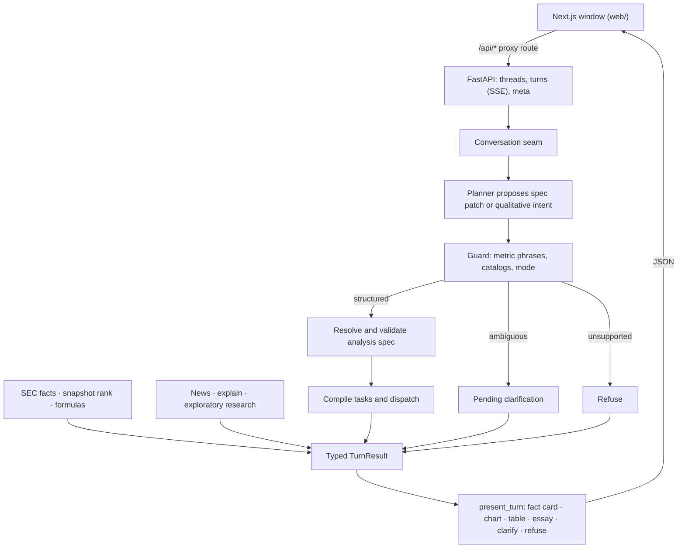

# Onfile

[](https://github.com/bpyman/onfile/actions/workflows/ci.yml)
[](https://www.python.org/downloads/)
[](web/README.md)
[](https://onfile-analyst.vercel.app)

**Explore company financials, straight from SEC filings.**

Ask about a company and get the number and the filing behind it. Onfile is an evidence-first research agent. A planner reads the question, rules first and a language model where the rules are unsure; deterministic code owns every number: the quarterly facts, the arithmetic, the rankings, and the values on screen. Click any figure, in a table or on a chart, to see the exact amount, CIK, accession, XBRL concept, and a link to the filing it came from.

<p align="center">
  <a href="https://onfile-analyst.vercel.app"><strong>Try the live demo</strong></a> ·
  <a href="#run-it-locally">Run it locally</a> ·
  <a href="docs/design.md">Design</a> ·
  <a href="docs/adr/">ADRs</a>
</p>


<sub>"Compare Eli Lilly and Pfizer revenue over the last eight quarters", on the public demo. Fiscal fourth quarters are derived from the 10-K and marked †.</sub>

**Results**
- **Planners, on 160 held-out conversations written by another lab's model (xAI's Grok 4.7):** rules planner 96%, LLM planner 94%, and the rules-first cascade 97% ([comparison](docs/evaluation/planner-comparison.md)).
- **Within noise, so decided on cost:** no difference between the planners is significant (p = 0.22 to 0.73). The live demo runs the cascade ([ADR 0012](docs/adr/0012-the-live-planner-is-a-rules-first-cascade.md)), which sent 7% of planner calls to the LLM: $0.13 for the run against $1.93 for the LLM planner alone ([comparison](docs/evaluation/planner-comparison.md)).
- **Everyday wording:** 518 of 518 phrasings of metrics, windows, changes and follow-ups, alone and in combination, read as [the defaults](#how-a-question-is-read) say ([phrase coverage](docs/evaluation/phrase-coverage.md)).
- **Figures checked against their filings:** 25 of 25 found in the text of the 10-Q they cite ([filing check](docs/evaluation/filing-check.md)).
- **What did not work, and what changed:** [retired approaches, wrong numbers, and a held-out set I had read](#what-failed-and-what-i-changed).

## How it works

The planner proposes; code owns every number.

1. **SEC quarterly facts, with provenance.** Standalone 10-Q amounts from companyfacts XBRL, each with its accession, period, concept, and an EDGAR filing link.
2. **Constrained planning.** The planner (rules first, a language model where the rules are unsure) proposes a typed analysis-spec patch; code resolves CIKs, catalog metrics, and period windows. It does not chain tools or invent constituents.
3. **Answers the model cannot rewrite.** Tables and charts render from tool output. Essays pass a numeral lock. Ambiguous metrics get a clarifying question; unknown scope is refused.
4. **Follow-ups edit the analysis.** `add Tesla`, `show year-over-year` or `make that the last four quarters` patches the spec on screen instead of starting over; the chips above the conversation show it, and a chip's × removes it while + adds a company or metric.
5. **Like-for-like comparisons.** Year-over-year change reads the prior quarter as the current filing restates it, so stock splits and restatements don't distort growth, and a per-share level filed before a split is shown on the basis after it, divided by the split ratio the company reports ([ADR 0009](docs/adr/0009-year-over-year-reads-the-comparative.md)). Ratios on a negative base (return on negative equity, a margin on negative revenue) say "Not meaningful" instead of printing a number.
6. **Degrades instead of failing.** Every SEC request has a deadline and every turn a budget; a company whose data fails gets its own "Source unavailable" row while the rest of a ranking or comparison answers; bad documents are never cached; SEC's rate limits are honoured. The app was red-teamed across its API, planner, numbers, window and failure modes.

## What it can answer

| Ask about | For example |
|---|---|
| Quarterly figures | revenue, net income, operating and gross margin, EPS, R&D, cash flow, cash, shareholders' and total equity, dividends; for banks, net interest and noninterest income |
| Derived figures | EBITDA, return on equity, P/E, trailing-year net income, R&D and SG&A as a share of revenue, share price ([ADR 0008](docs/adr/0008-balance-sheet-trailing-year-and-market-figures.md)). A derived figure whose part a company's filings do not report as a standalone quarter is missing, with a note naming the part: AMD's EBITDA, since its filings report depreciation only for the year. |
| Comparisons and trends | `Compare Eli Lilly and Pfizer revenue over the last eight quarters` |
| Growth and overviews | `Compare Microsoft and Apple revenue growth` charts the growth rates; `How is Nvidia doing?` answers in a sentence with recent quarters |
| Rankings | `Top 10 technology companies by net margin`, over a dated snapshot of about 5,200 US-listed operating companies; the roughly 4,000 that file 10-Qs are ranked |
| Filing changes | `What changed in Microsoft's latest 10-Q?`, a paragraph diff of MD&A and Risk Factors with the changed words marked |
| Context | recent news and a short explanation, kept apart from the numbers |

What a question leaves out has a default, so the same words always get the same answer: no period is the latest quarter, an ambiguous word asks which one, and so on. Every default is listed in [How a question is read](#how-a-question-is-read).

Every answer can be checked and taken away: click a figure for its source, sort any column (the chart follows), copy it as Markdown with its sources, download the table as CSV, or copy a link that asks the same question. Comparisons over time read as quarters × companies, and a fact card shows its year-over-year and quarter-over-quarter change. Press `/` to ask and ↑ to recall the last question.

<table>
  <tr>
    <td width="50%"></td>
    <td width="50%"></td>
  </tr>
  <tr>
    <td><sub>What changed in the latest 10-Q: a deterministic paragraph diff, with the words that changed marked.</sub></td>
    <td><sub>Every value opens to its exact source: amount, CIK, accession, concept, and filing.</sub></td>
  </tr>
  <tr>
    <td width="50%"></td>
    <td width="50%"></td>
  </tr>
  <tr>
    <td><sub>A company overview answers in a sentence, then shows its recent quarters.</sub></td>
    <td><sub>Sort any table column; the chart's bars follow the table.</sub></td>
  </tr>
</table>

## Try it

Hosted demo (opens on the live runtime, straight from SEC EDGAR; switch to Recorded for the captured filings): [onfile-analyst.vercel.app](https://onfile-analyst.vercel.app). If the API is slow to answer, the guided stories answer at once from the recorded runtime, marked "Demo data". The window also installs as a desktop app from the browser. Or [run it locally](#run-it-locally) in two commands.


[Walkthrough video](docs/portfolio/images/demo-walkthrough.mp4): Eli Lilly, Pfizer and Merck revenue over eight quarters, the follow-up `show year-over-year` redrawing it as growth rates, then the exact 10-Q source behind a Lilly value.


The images are captured from the window by a Playwright script against the recorded runtime, so they can be regenerated whenever the window changes (see [Portfolio images](#portfolio-images)).

## Evaluation

| What | Result | How it was measured |
| --- | --- | --- |
| [Planner comparison](docs/evaluation/planner-comparison.md) | Held out: rules planner 96%, LLM planner 94%, cascade 97% (no difference significant) | 160 conversations xAI's Grok 4.7 wrote from a brief frozen first, labelled again blind, run end to end on the recorded runtime with only the planner swapped |
| [Filing check](docs/evaluation/filing-check.md) | 25 of 25 figures found in the filing's own text | Figures the live window shows, across sectors and metrics, looked up in the 10-Q each cites |
| [Numeral lock](docs/evaluation/numeral-lock.md) | Withholds every changed or invented number; passes every true figure as shown, or rounded to two or more significant digits | Known sentences over ten recorded answers' grounding; no model |
| [Phrase coverage](docs/evaluation/phrase-coverage.md) | 518 of 518 everyday phrasings of metrics, windows, changes and follow-ups, alone and in combination, read as [the defaults](#how-a-question-is-read) say | Each asked as a whole question on the recorded runtime; a test fails on any new misreading, and on any phrasing the live cascade would newly send to the LLM |
| [Company name coverage](docs/evaluation/company-coverage.md) | 98.7–98.8% of 5,161 companies found for each name form, 100% as `$TICKER` | Every snapshot company asked about in six forms of its name |
| [Scorecard](docs/evaluation/scorecard.md) | 30 recorded-runtime cases, with p50/p95 latency | Lookups, calendars and derived quarters, growth, rankings, refusals, clarification, follow-ups, filing changes, the numeral lock |

**Which planner, and why.** The live demo plans every turn with the rules planner, and asks the LLM planner only where the rules planner's plan shows it was unsure: 7% of planner calls on the fifth held-out set. On those 160 conversations the cascade scored 97% against the LLM planner's 94% and the rules planner's 96%, at $0.0002 a planner call against $0.0035, and with a median planner time of 1 ms against 1.1 s. No difference between the planners is significant ([findings](docs/evaluation/held-out-5-findings.md)); the decision itself is [ADR 0012](docs/adr/0012-the-live-planner-is-a-rules-first-cascade.md), made on the fourth set and borne out by the fifth.

**How the held-out set was kept honest.** Its brief was committed before any case existed, after three rounds of throwaway probe questions had made its rules clear. Grok 4.7, from a lab that built neither planner, wrote and labelled the 160 cases in a folder holding only the brief, the README, the glossary and three ADRs; a blind Claude session labelled them again, and the two agreed on every field of 159 (the one difference was settled before any planner ran). The cases, an overlap report and the analysis plan were committed before the run ([plan](docs/evaluation/held-out-5-plan.md)). Earlier sets were each held out once and then read or tuned on; the [protocol](docs/evaluation/planner-comparison.md#protocol) says what happened to each. The three cases every planner failed are defects in the code all planners share; questions whose template the app had seen score 3 to 4 points higher than novel ones ([findings](docs/evaluation/held-out-5-findings.md)).

**The numeral lock's limits.** It checks numbers, not meaning: a true figure given to the wrong company passes, and so does a number written in words. It catches every changed or invented digit.

### Running the evaluations

The offline suite is the default CI gate. It runs on the recorded runtime and the rules planner, so it needs no keys and can pin exact figures ([ADR 0011](docs/adr/0011-the-rules-planner-is-the-keyless-planner.md)):

```text
uv run python -m pytest -q
uv run python -m financial_analyst_agent.evaluation            # the scorecard
uv run python -m financial_analyst_agent.numeral_lock_evaluation
uv run python -m financial_analyst_agent.phrase_coverage       # everyday phrasings, about 30 s
uv run python -m financial_analyst_agent.held_out_overlap      # held-out cases seen before
uv run python scripts/check_against_filings.py                 # live: reads about 25 filings from SEC
```

Live network tests need keys:

```text
uv run python -m pytest tests/integration/test_live_openai_planner.py -m network
uv run python -m pytest tests/integration/test_live_sec_lookup.py -m network
uv run python -m pytest tests/integration/test_live_tavily_news.py -m network
```

The planner comparison is free for the rules planner. The LLM planner and the cascade call OpenAI, so they take prices and one budget for both:

```text
uv run python -m financial_analyst_agent.planner_evaluation                       # rules planner, free
uv run python -m financial_analyst_agent.planner_evaluation --estimate --runs 3   # tokens for an LLM run
uv run python -m financial_analyst_agent.planner_evaluation --planners rules,llm,cascade \
    --runs 3 --paid-split held_out --input-price <usd per 1M> --output-price <usd per 1M> \
    --budget-usd <cap>
```

## What failed and what I changed

Approaches I built, then retired:

- **A Streamlit window.** The first audience window was a Streamlit app. It became a Next.js window over a small FastAPI seam, so every number is still formatted in Python and a thread is bound to one runtime. [ADR 0006](docs/adr/0006-react-audience-window.md), [#4](https://github.com/bpyman/onfile/pull/4), [#6](https://github.com/bpyman/onfile/pull/6).
- **A lock on year-to-date subtraction.** ADR 0003 forbade deriving any quarter, so every multi-quarter window skipped fiscal fourth quarters and cash flow could not be offered at all. It became two labelled derivations: the 10-K's year minus the nine months, and a year-to-date difference. Each is marked derived and keeps both filings as evidence. [ADR 0007](docs/adr/0007-derived-quarters-and-per-share.md), [#16](https://github.com/bpyman/onfile/pull/16).
- **Issuer-name catalogs.** Ranking first excluded funds and acquisition shells by words in their names (`Fund`, `BDC`, `Acquisition`, `Capital Corp`). That missed ordinary-named shells and dropped real operating companies. Membership is now structural (security type, listing title, issuer industry) plus a CIK blocklist, and lookups apply the same rule. [ADR 0001](docs/adr/0001-snapshot-membership.md), [ADR 0002](docs/adr/0002-lookup-membership.md), [`9c8c1f3`](https://github.com/bpyman/onfile/commit/9c8c1f3) replaced by [`1fd4215`](https://github.com/bpyman/onfile/commit/1fd4215).
- **Year over year against the original filing.** A change subtracted the year-earlier quarter as first filed. After NVIDIA's ten-for-one split, its diluted EPS read −87.3% instead of +26.7%. A change now starts from the comparative the newer filing reports on the current basis. [ADR 0009](docs/adr/0009-year-over-year-reads-the-comparative.md), [#48](https://github.com/bpyman/onfile/pull/48).

Bugs the second red-team round found:

- **One busy refund broke every turn.** Refunding a turn turned away as busy left an empty rate-limit record, and from then on every turn, for every visitor, returned 500 until the process restarted. [#45](https://github.com/bpyman/onfile/pull/45).
- **Wrong numbers** ([#48](https://github.com/bpyman/onfile/pull/48)), each checked against SEC company facts or the filing:
  - EPS growth across a stock split showed −87.3% instead of +26.7%.
  - Revenue took one tagged line instead of the total: $25.83M instead of $263.59M for Verra Mobility.
  - Derived fourth quarters ignored nine-month figures the 10-K had revised: Rapid7's net income read −$1.48M instead of +$2.17M.
- **A slow SEC response froze the service.** A response dripping one byte at a time kept a turn open and its thread locked, and four of them made every visitor "busy". A turn now ends with "Source unavailable" and frees its slot. [#47](https://github.com/bpyman/onfile/pull/47).
- **Capitalised words were read as tickers.** "WHAT IS NVIDIA NET MARGIN NOW?" added ServiceNow. Ordinary words and finance acronyms no longer resolve as tickers; real ones like `NOW revenue` still do. [#46](https://github.com/bpyman/onfile/pull/46).

What the planner comparisons found ([ADR 0010](docs/adr/0010-one-reading-of-names-and-windows.md), [ADR 0012](docs/adr/0012-the-live-planner-is-a-rules-first-cascade.md)):

- **An LLM planner on every turn.** The live demo planned every turn with `gpt-5.6-terra`. On the fourth held-out set it was not measurably better than the rules planner (88% against 85%, p = 0.50), so it now plans only where the rules planner is unsure: the same 88%, at a fifth of the cost. The fifth set, written by another lab's model, agreed: LLM planner 94%, rules planner 96%, cascade 97%.

- **Three resolvers for one name.** The rules planner read names with its issuer index, spec resolution used a narrower resolver, and the facts lookup resolved the words again from SEC titles. "Goldman Sachs" from the LLM planner was resolved to GS and then shown as "company not found". Live, "Coca-Cola" came back ambiguous between three bottlers. There is now one reading of a name.
- **A period reader that knew six numbers.** "Past six quarters" and "previous nine quarters" fell back to the latest quarter. One grammar now reads any recency word, count and unit.
- **"Target" the word.** "Nvidia's target margin" added Target. Whether a name is also an everyday word now comes from case in 10-Q text, and the word counts as the company only where the question uses it as one.
- **A held-out set I had read.** My brief asked the first blind labelling session to return its cases, so I saw them while changing the planner. They became development cases, and a second session wrote the held-out set, reporting only counts.

- **A numeral lock that withheld true figures.** It matched digits exactly, and an essay's grounding holds 22974000000, so a true "$22.97 B" or "30.9%" was withheld every time. A number now also passes when it rounds from a grounded value at the precision written, to at least two significant digits; changed and invented numbers are still withheld ([measurement](docs/evaluation/numeral-lock.md)).

As an independent check outside the XBRL data the app reads, [the filing check](docs/evaluation/filing-check.md) opens the 10-Q each figure cites and looks for the number in the filing's own text: **25 of 25** figures were found.

## Architecture

The audience window is a Next.js app. The browser only calls the window's own `/api/*`; a route handler proxies each call to a small FastAPI service (`financial_analyst_agent.api`), so the Python origin is never a second public entry point. The API adds no financial logic: it is a transport over the conversation seam, the thread store, and `present_turn`, which turns a result into display records. Every amount shown as text is formatted in Python, and a turn streams progress over server-sent events. See [ADR 0006](docs/adr/0006-react-audience-window.md).

Behind the seam, a persisted **conversation thread** carries a patchable **analysis spec**. Follow-ups edit companies, metrics, periods, and operations instead of restarting. `run_turn` remains a one-message wrapper over a thread, which the per-intent tests use.



Full design: [`docs/design.md`](docs/design.md). ADRs: [`docs/adr/`](docs/adr/).

## Built with

Python 3.12 (FastAPI, Pydantic, LangGraph, Decimal arithmetic) managed by uv, with the same tools served over MCP · Next.js and React with Recharts · SEC EDGAR companyfacts XBRL and filing text · Financial Modeling Prep for the ranking snapshot · OpenAI for planning and essays in live mode, with a rules planner when no key is set · pytest and Playwright browser checks in GitHub Actions · Vercel and Render.

## Run it locally

The window is a Next.js app (`web/`) that proxies `/api/*` to a Python API ([ADR 0006](docs/adr/0006-react-audience-window.md)). You need [uv](https://docs.astral.sh/uv/) and Node 22 (`.nvmrc`). One-time setup:

```text
uv sync
npm --prefix web install
cp .env.example .env        # Windows: copy .env.example .env
```

`.env.example` sets `APP_MODE=recorded` (`fixture` still works as a deprecated alias), so no keys are needed. Then run the API and the window, each in its own terminal:

```text
uv run serve-api            # the API on http://127.0.0.1:8000
npm --prefix web run dev    # the window on http://localhost:3000
```

Open http://localhost:3000 and click a guided story. [`web/README.md`](web/README.md) lists the window's environment variables, checks, and the browser check.

Beyond the guided stories, try these. Follow-ups such as `add Tesla` patch the analysis instead of starting over.

1. What was Microsoft's latest quarterly pretax income?
2. Compare Tesla and GM revenue
3. What are the top 10 tech companies and R&D spend for each?
4. add Tesla
5. make that the last four quarters
6. Apple diluted EPS in Q3 FY2025
7. Compare Cisco and Oracle revenue calendar Q2 2026

Named periods ("Q3 2024", "fiscal 2025") use each company's own fiscal calendar; a calendar quarter ("calendar Q2 2026") is each company's quarter whose middle falls in it. A fiscal fourth quarter, which companies report only inside the 10-K, is derived as the year minus the nine months and marked † with both source facts in the evidence; per-share figures are never derived ([ADR 0007](docs/adr/0007-derived-quarters-and-per-share.md)). Cash and equity are balance-sheet amounts at the quarter's end; return on equity and P/E use trailing-year net income; P/E and share price use the snapshot's market data, so P/E is given for the latest period only ([ADR 0008](docs/adr/0008-balance-sheet-trailing-year-and-market-figures.md)).

The recorded runtime replays captured SEC, news, and model responses through the same orchestration and renderer as the live runtime. It proves orchestration, not EDGAR freshness. `APP_MODE=live` with the keys in `.env` runs the live runtime.

## Deploy

The API also ships as a Docker image. It installs from `uv.lock`, runs as a non-root user, listens on `$PORT` (default 8000) on all interfaces, starts on the recorded runtime unless `APP_MODE=live` is set, and has a health check on `/api/health`. The image holds only the installed package: no tests, `web/`, or dev tooling.

```text
docker build -t financial-analyst-api .
docker run --rm -p 8000:8000 financial-analyst-api

# what CI runs: health check, a recorded thread, and the "Verify a quarterly fact" turn
python3 scripts/smoke_api_image.py --image financial-analyst-api
```

The same script checks an API that is already running: `--base-url https://<host>`, plus `--proxy-token` when `API_PROXY_TOKEN` is set.

The hosted setup is the Next.js window on Vercel (`web/vercel.json`) and this image on Render (`render.yaml`). Render deploys a commit only after CI passes. [`docs/deploy.md`](docs/deploy.md) lists every environment variable for each service and where it is set. To go live, run `scripts/deploy_wizard.sh`. It walks through the account steps and checks each one.

## Maintenance

Rebuild the ranking freeze (not during a demo turn):

```text
uv run build-universe-snapshot
```

The rebuild also asks SEC EDGAR which companies are foreign private issuers (their latest annual report is a 20-F or 40-F, or, newly listed, they furnish 6-Ks; either way they have no 10-Q facts) and marks them `files_quarterly: false`; rankings and peer suggestions skip them, lookup still finds them. To refresh just those flags on the existing freeze, without re-fetching FMP or changing its date or market caps:

```text
uv run build-universe-snapshot --annotate-filers
```

Then carry that freeze into the recorded runtime, which the public demo offers beside Live: this copies the freeze's date and market caps into the recorded ranking snapshot and re-records the latest 10-Qs from SEC EDGAR for every recorded company.

```text
SEC_USER_AGENT="app-name you@example.com" uv run python scripts/record_sec_fixtures.py
```

MCP tools (same contracts as in-process) can be served locally:

```text
uv run python -m financial_analyst_agent.mcp_server
```

## Portfolio images

`web/scripts/capture-portfolio.ts` drives the window the way a visitor would: for the walkthrough, Eli Lilly, Pfizer and Merck revenue, then `show year-over-year`, then the exact 10-Q source; for the stills, compare four quarters, then `add Apple`, then the inspector. It also asks the showcase questions (Eli Lilly vs Pfizer revenue, what changed in Microsoft's latest 10-Q, an overview and a sorted ranking) and rewrites every image in [`docs/portfolio/images/`](docs/portfolio/images/): the stills at 2x, the 1200×628 link preview (the landing headline beside the Lilly vs Pfizer chart, composed by `web/scripts/social-card.ts`), and the walkthrough as MP4 and GIF. It uses the recorded runtime and the default dark theme, and needs ffmpeg on `PATH` or in `$FFMPEG`.

```text
cd web
npm run build
npm run capture
```

It starts the recorded API and the built window itself, as the browser check does, or reuses them if they are already running.

## How a question is read

What a question leaves out has a default, so the same words always get the same answer. Evaluation sets are labelled from these rules, and phrase coverage tests them.

| You ask | You get |
|---|---|
| No period: `Apple revenue`, `last quarter` | The latest quarter |
| A window: `last 3 quarters`, `past two years`, `18 months`, `since 2024` | That many recent quarters, at most 40 |
| A named period: `Q2 2025`, `fiscal 2025`, `calendar Q2 2025` | That quarter or year, on each company's own fiscal calendar unless `calendar` is said |
| Trailing twelve months: `TTM net income`, `LTM net income` | One trailing-year amount (ADR 0008) |
| Growth: `How fast is Apple's revenue growing?` | With no period, the latest 5 quarters, each with its year-over-year change |
| Year over year: `Apple revenue year over year`, `versus last year` | With no period, the latest 8 quarters, each with its year-over-year change |
| Quarter over quarter: `quarter over quarter`, `QoQ`, `sequentially` | With no period, the latest 5 quarters, each with its change on the quarter before |
| A change with no base: `Why did revenue drop?`, `How much did revenue change?` | A question: compared with what? |
| A why or yes-no question: `Why is Goldman's revenue so volatile?` | The figures it names, with a note that filings report what changed, not why |
| An ambiguous word: `profit`, `income`, `margin`, `cash flow`, `interest`, `expenses`, `dividends`, `tax` | A question: which one? (ADR 0004) |
| Two metrics: `revenue and net income` | Both |
| A measure the catalog lacks: `debt`, `debt-to-equity`, `customer acquisition cost` | It says it cannot look that up yet, and lists what it can |
| A segment or operating figure: `iPhone sales`, `Google Cloud revenue`, `deliveries` | The company-wide figure, with a note that filings report totals, not segments. With no company named, a segment one company reports names it: `iPhone sales` is Apple's revenue, `AWS` Amazon's, `Azure` Microsoft's |
| An overview: `How is Apple doing?`, `the rundown on Apple` | Revenue, net income and three margins for the latest quarter, with five quarters of revenue and net margin |
| A ranking: `top banks by revenue`, `biggest tech companies` | The 10 largest companies in the group by market value, or as many as asked |
| A follow-up that adds: `add Microsoft`, `also Microsoft`, `Microsoft too`, `add net income`, `and net income too` | What is on screen, plus Microsoft or net income |
| A follow-up that replaces: `what about Microsoft?`, `same for Microsoft`, `what about net income?` | That in place of the companies, or the metric, on screen |
| A general question: `What is EPS?`, `How might AI change banking?` | An explanation, marked as the model's, with no figures |
| A filing change: `What changed in Microsoft's latest 10-Q?` | The latest 10-Q against the one a year earlier: MD&A and Risk Factors |

**Periods**

- `last quarter`, `this quarter` and `the most recent quarter` are the latest quarter.
- Counting a window: a year is 4 quarters, a decade 40, and months a third, rounded up. `the past year` is 4; `a few` and `several` are 4 and `a couple of` 2, each of whatever they name (`a few months` is 2 quarters, `a couple of years` 8). A year and a half is 6 quarters, `2.5 years` 10.
- A count and a unit after the metric need no `last` or `past` (`Apple revenue 18 months`, `6 quarters`); `12-month` in `trailing 12-month revenue` is the trailing year, not a window.
- `since 2024` or `since the start of 2024` is every filed quarter that ended on or after 1 January 2024, counted from the filings rather than today's date, the latest 40 when there are more; a note says when the filings lack a quarter in that span. `since the start of fiscal 2025` (or `since FY2025`) counts from each company's own fiscal 2025.
- `through fiscal 2025` and `during fiscal 2025` are that fiscal year. A calendar quarter (`calendar Q2 2026`) is each company's quarter whose middle falls in it.
- Trailing twelve months is also `trailing twelve month` or `last twelve months` directly before the metric: one amount, net income over the four quarters to the latest report, from the 10-K's year or derived from it and the year to date. After the metric, `net income over the last twelve months` and `last twelve months of net income` are windows of 4 quarters. A figure with no trailing-year form (`TTM revenue`) shows its latest 4 quarters, and beside another metric (`TTM net income and revenue`) the trailing-year figure sits beside the other's latest quarter.

**Changes**

- A change over a named window shows that window. Quarter over quarter keeps its base (`last 2 quarters quarter over quarter` is 2 quarters, each with its change on the quarter before); any other change wording is year over year over the window: `growth over the last 4 quarters`, `How did EBITDA change over the past year?`, `Over the past 10 quarters, how has revenue moved?`, `How much did revenue change since 2023?`. `revenue since 2025 year over year` is every quarter since 2025 began, each with its change.
- With a named period (`Q2 2025 year over year`, `fiscal 2025 quarter over quarter`), those quarters, each with its change.
- Growth with no metric (`How fast is Apple growing?`, `Is Apple growing?`) is revenue, whichever planner reads it.
- Year over year is also `versus the same quarter last year` and `up from a year earlier`. After a question about several quarters or a named period, a follow-up asking for year-over-year change or growth (`show that year over year`, `as growth`) keeps those quarters; after one quarter, it shows the latest 8.
- Quarter over quarter is also `quarter on quarter`. Where a quarter's year-earlier quarter is on screen too, its year-over-year change shows beside. After a year-over-year view, `sequential instead` switches the change and keeps the quarters, as `year over year instead` switches back.
- Naming both bases (`sequentially or versus last year`, `quarter over quarter and year over year`), wherever they sit in the question, shows both changes on every quarter: year over year from each quarter's own comparative, and the change on the quarter before. With no window, 5 quarters. As a follow-up, it keeps the quarters on screen. One base `instead of` or `rather than` the other is that base alone.
- A change with no base also: `What drove the change in revenue?`, `What caused revenue to fall?`. It is asked about whichever planner reads it, even as news, unless the question asks for news by name (`news`, `headlines`). A yes-no question about figures (`Is AMD's gross margin close to Nvidia's?`) shows them; Management's Discussion and Analysis explains why.

**Metric words**

- An ambiguous word asks even when the rest of the question hints (`how much interest did JPMorgan pay`) or names a catalog metric beside it (`fee income and noninterest income`). `net interest` asks too; `net interest income` and `NII` name the bank figure.
- A phrase that names one figure is that figure: `earnings` is net income; `EPS` and `earnings per share` are diluted EPS, `basic EPS` basic; `tax rate` is the effective tax rate; `EBIT` is operating income; `SG&A as a percentage of sales` is the SG&A ratio and `R&D as a percentage of revenue` R&D to sales; `income before taxes` and `noninterest income` are those figures. `profit margin` is net margin, with a note saying so. `fee income`, which no single filing figure measures, asks which.
- An unknown measure stays unknown even when a word inside it would be ambiguous alone (`equity` in `debt-to-equity`). Beside a catalog metric (`Apple revenue and dividend yield`), the catalog metric is answered.
- A per-share figure with no period, when the latest quarter is a fiscal fourth (`Cisco EPS`), is the latest quarter with its own per-share figure, with a note saying which quarter it stepped past: a 10-K reports EPS and dividends per share only for the year, and per-share figures are never derived (ADR 0007). Named (`Cisco EPS in Q4 FY2026`), that quarter says it is reported only for the year; in a window, it is a blank row saying so.

**Companies**

- A company's other names (`Chase`, `Wells`, `BofA`, `$GOOGL`) are that company, and `Google and Alphabet` is one company. A fund beside a company (`SPY and Apple revenue`) is left out with a note; one company left on screen is a lookup.
- A company name that is also a word names the company only where the question uses it as one, whichever planner read it: `intel aside`, `any intel on`, `to the micron`, `a micron`, `the apple of`, `an oracle for` and `apples to apples` name no company, while `Intel and Palantir operating income` names both.
- A figure with no company (`What's the EPS?`, `What was net income this quarter?`) asks which company, whichever planner read it; a word of the metric phrase (`net`, `free`) is never the company. A segment one company reports names it (`iPhone`, `iPad`, `Mac`: Apple; `AWS`: Amazon; `Azure`, `Xbox`: Microsoft; `Google Cloud`, `YouTube`: Alphabet; `Instagram`, `WhatsApp`: Meta), whichever planner read the question; a company named beside it stays the one named.

**Overviews and rankings**

- An overview is also `how is Apple performing`, `how has Apple been performing`, `a quick read on Apple` or `Apple's performance`. With a window (`Apple's performance over the last 4 quarters`), those quarters. A measure the catalog lacks keeps its refusal (`Apple's stock performance`). A bank reports no gross or operating margin, so those rows say the filings hold none.
- A ranking with a metric shows each company's latest quarter, ordered by it when asked `by` it (`top 5 banks by net income`) and by market value when asked `and their` (`top 5 banks and their net income`). `top 2 semiconductor companies by R&D` is the two largest, ordered by R&D, not the two that spend most. A window (`over the past year`) or a named period still shows each company's latest quarter, with a note, and the analysis records that quarter, so `add Intel` after it compares the latest quarter too. A ranking's growth (`top 5 banks by revenue growth`) is each company's latest quarter against the year before; adding a company to it shows growth over growth's own window.
- With no group (`which companies are worth the most?`), every company in the snapshot. Everyday group names name their industry (`semis`, `chipmakers`, `drugmakers`, `big banks`), and a group `by` a metric is a ranking without `top`. A ranking reads whatever comes first: a count (`5 banks by net income`, `the 3 biggest banks`) or a window or other preamble (`Over the past year, the top 3 drugmakers by gross margin`). Largest first; `lowest first` orders the same companies from the lowest. `bottom 5` is refused: rankings start from the largest. After a ranking, `add Intel` makes a comparison of the companies on screen and Intel.

**Follow-ups, explanations and filing changes**

- A follow-up keeps the metric and window. `drop`, `remove`, `take out`, `without`, `swap X for Y` and `make it the last 8 quarters` edit what is on screen; `add` and `too` show a metric beside the ones on screen, and `what about` puts it in their place.
- The explanation wording decides (`explain`, `how does … affect`, `how is … calculated`, `why does … matter`, `what does … mean`, and `what is X` for a measure alone), not the absence of a company alone. With a company named and a metric (`How does Apple's buyback affect its EPS?`, `Why is Goldman's revenue so volatile?`), it is that company's figure, whichever planner reads it, with the why note where the question asks why. A company and no metric (`How might AI change Goldman Sachs's business?`) stays an explanation.
- A filing change compares 10-Ks when asked about the `10-K` or `annual report`; `what's new in` is `what changed in`. With no company, it asks which.

## Limitations

- Ranking membership is a dated snapshot of US-listed operating companies, not a live screener; companies that file no 10-Qs (foreign private issuers) are left out of rankings.
- Quarterly facts are directly reported standalone quarters where the filing has one. Otherwise only two derivations are made, both marked †: a fiscal fourth quarter (the 10-K's year minus the nine months) and a year-to-date difference (ADR 0007). Per-share figures are never derived.
- The metric catalog is closed. Unknown or ambiguous phrases do not guess, and segment figures (AWS, iPhone) are not reported on their own: the answer shows the company-wide figure and says it is not the segment.
- Foreign private issuers (20-F and 40-F filers) have no 10-Q facts, and subsidiaries that file jointly with their parent have no quarterly figures of their own in SEC's data.
- Questions are read in English.
- Public live SEC, if enabled, is quota-guarded. Unrestricted OpenAI/Tavily spend is not exposed to visitors.

## Author

[Blake Pyman](https://github.com/bpyman) — portfolio project.

## Origin

This repo began in August 2026 as a proof of concept built to a technical brief and continues as a portfolio project.
