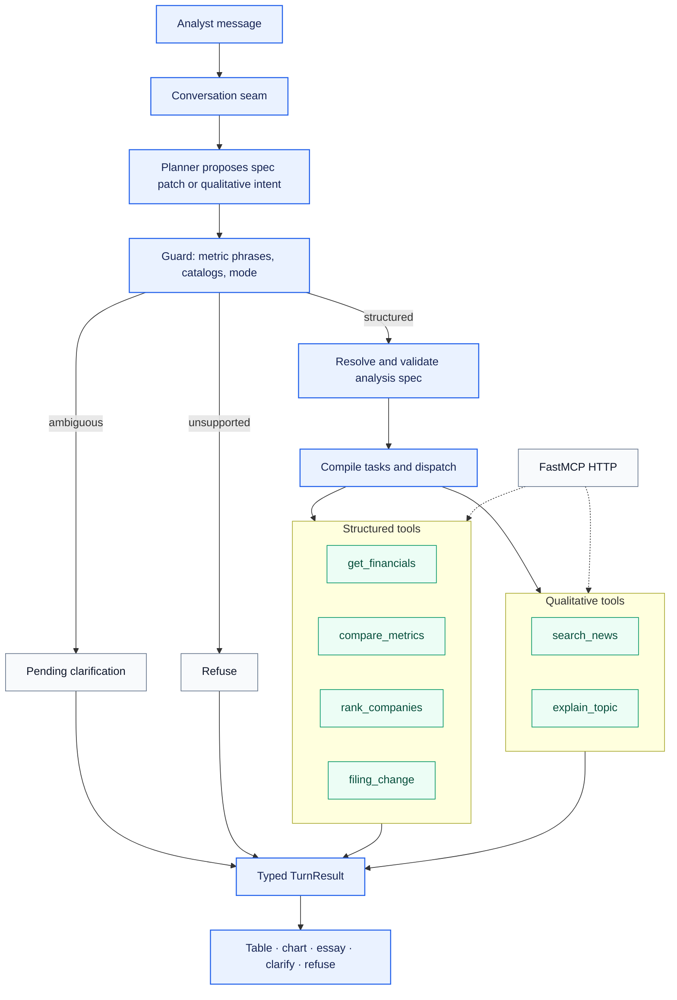

# Onfile

> **System design:** constrained model planning, deterministic financial tools, and
> provenance-first answers.

The agent answers questions about quarterly financials, company comparisons, market rankings,
and current events. A language model interprets the question, but deterministic code owns
financial facts, arithmetic, company identity, ranking membership, and the final display of
numbers.

## Architecture

### Request lifecycle

1. **Load thread** — a conversation thread holds messages, the current analysis spec, pending
   clarification, and evidence references. Follow-ups patch that spec instead of restarting.
2. **Plan** — the planner proposes a typed spec patch or a closed qualitative intent. It never
   emits a resolved spec, CIKs, or numbers.
3. **Guard** — metric phrases resolve against the closed catalog. Ambiguous input pauses the
   analysis graph on an `interrupt` (a pending clarification, resumed by the analyst's answer);
   unsupported scope refuses before data access.
4. **Execute** — code compiles the resolved spec into lookup, compare, rank, or rank-and-lookup
   tasks for the structured-analysis subgraph. Filing comparison and the qualitative intents run
   as their own graph nodes. Tool order is fixed.
5. **Collect evidence** — tools return typed values with filing, period, identity, snapshot, or
   citation provenance. Filing-change diffs are deterministic text maps, not model rewrites.
6. **Render** — a typed `TurnResult` becomes a chart and table, grounded essay, clarification, or
   refusal. Financial values are never rewritten by the model.

`run_turn(query, runtime)` remains a wrapper over a one-message thread, which the per-intent
tests use. The public seam is `run_conversation_turn`. See
[ADR 0005](adr/0005-stateful-analysis-graph.md). The trust boundary is identical on both paths.

## System boundaries

### Next.js window — audience layer

A Next.js app (`web/`) collects a question, shows guided stories, the active analysis spec,
runtime status, answers, evidence inspection, and expandable tool traces. It contains no
financial business logic: it draws the display records the API sends. See
[ADR 0006](adr/0006-react-audience-window.md).

### FastAPI — HTTP seam

`financial_analyst_agent.api` is transport only. It creates threads bound to a runtime, streams
each turn's progress over server-sent events, and serialises `present_turn` output. The window
reaches it through its own `/api` proxy, which adds a shared token.

### `run_conversation_turn(thread_id, message, runtime)` — application boundary

Coordinates planning, spec patch application, validation, execution, and persistence.
The HTTP seam, tests, and the recorded runtime all call this interface. `run_turn` wraps it for one-shot
regression tests.

### Planner — language boundary

Selects a typed intent or spec patch. It cannot invent workflows, choose ranked constituents,
calculate values, pick filings, or resolve an ambiguous metric.

### Executor and tools — correctness boundary

Own company resolution, fact selection, ranking, comparisons, formulas, filing-section diffs,
news retrieval, and workflow composition. Company identity is carried as SEC CIK rather than
model-generated ticker text.

### Runtime adapters — provider boundary

Connect the application to SEC EDGAR, a packaged FMP snapshot, Tavily, and OpenAI. Recorded
adapters provide the same contracts in the recorded runtime. Live SEC responses are disk-cached,
and a company's cached data lasts until SEC's latest-filings feed shows it has filed a 10-Q, a
10-K or an amendment ([ADR 0013](adr/0013-cached-sec-data-lasts-until-the-company-files.md)).
A company's facts are kept as a small digest, and the largest companies' are fetched in the
background before anyone asks ([ADR 0014](adr/0014-a-warm-set-of-company-digests.md)).

### `TurnResult` — presentation boundary

Carries intent, ordered traces, values, provenance, citations, disclosure changes, failures, and
renderer choice. This keeps provider output and presentation decoupled without losing audit
information.

## Key design decisions

### 1. Constrained agency

**Decision:** use a closed intent set and deterministic executors instead of an open ReAct loop.

**Why:** the workflows are known and mistakes can change financial meaning. The model interprets
language; code controls tool order and data flow. For rank-and-lookup, ranked CIKs pass directly
into fact lookup—the model never generates the constituent list.

**Trade-off:** new workflows require code and tests, but existing behavior remains predictable
and inspectable.

**Revision:** [ADR 0005](adr/0005-stateful-analysis-graph.md) keeps constrained agency and drops
the one-prompt-one-intent rule. Composition moves into a typed analysis spec the model may patch
but not resolve. An open ReAct loop over the number path stays rejected.

### 2. One application interface, replaceable adapters

**Decision:** all entry points call `run_turn(query, runtime)`, with providers injected through
`Runtime`.

**Why:** application behavior can be tested independently of the window and external services.
Live and recorded providers can change without creating separate execution paths.

**Trade-off:** the conversation seam is a critical module and must be kept cohesive as the product
grows. `run_turn` stays as a thin one-shot wrapper for the per-intent tests.

**Shipped:** [ADR 0005](adr/0005-stateful-analysis-graph.md) is the current architecture: a
persisted thread plus a patchable analysis spec. `Runtime` and its ports are unchanged.

### 3. SEC XBRL as the quarterly source of truth

**Decision:** retrieve directly reported standalone-quarter facts from SEC companyfacts.

**Why:** XBRL includes values, units, periods, forms, accessions, taxonomies, and concepts. That
supports deterministic selection and a verifiable EDGAR link. The selector does not derive
quarters from year-to-date values or silently choose an ambiguous concept.

**Trade-off:** issuer taxonomy differences require a reviewed concept catalog. PDF parsing is a
future verification fallback, not an equal source of truth.

See [ADR 0003](adr/0003-quarterly-fact-module.md).

### 4. Deterministic math and reproducible ranking

**Decision:** formulas use `Decimal` and period-aligned components; rankings use a dated
membership snapshot.

**Why:** the model should not calculate ratios or decide whether periods are comparable. A dated
snapshot also keeps market membership stable during a demo and across tests. Non-operating
listings are excluded, and multiple share classes collapse to one CIK.

**Trade-off:** formulas are limited to the reviewed catalog, and ranking is reproducible rather
than real-time. The snapshot timestamp is always part of the result.

See [ADR 0001](adr/0001-snapshot-membership.md) and
[ADR 0002](adr/0002-lookup-membership.md).

### 5. Provenance-first output and explicit failure

**Decision:** structured answers render directly from typed tool output. Ambiguity, missing data,
and unsupported scope remain visible product states.

**Why:** generated prose could round or rewrite a correct number. Tables preserve values and
their filing or snapshot provenance. Partial results keep valid rows while marking failures.
Ambiguous metric phrases clarify without running tools; unknown metrics and industries refuse.

Qualitative essays are separated from financial tables. Current-event essays use returned news
hits and citations; a numeral lock rejects any number the supplied evidence does not hold,
exactly or rounded to the precision written (at least two significant digits), and
[its measurement](evaluation/numeral-lock.md) says what it catches and what it cannot.

**Trade-off:** responses are more conservative and sometimes require the user to rephrase.

See [ADR 0004](adr/0004-ambiguous-metric-clarify.md), whose clarify mechanism becomes a resumable
interrupt under [ADR 0005](adr/0005-stateful-analysis-graph.md): the analyst answers the one open
question and the pending analysis continues. The candidate set is still the closed catalog.

### 6. Real MCP boundary without a fragile demo dependency

**Decision:** FastMCP exposes the five tool capabilities over HTTP, while the app may call the
same contracts in-process.

**Why:** MCP is a genuine integration boundary, but the live API path does not depend on a
stdio child process or unnecessary network hop. The five capabilities are financial lookup,
comparison, ranking, news search, and qualitative explanation.

**Trade-off:** the hosted demo does not demonstrate distributed MCP deployment. The contracts are
ready for it without imposing that operational cost on the audience window.

## Reliability model

The system prefers an explicit failure to a plausible but unsupported answer:

- missing facts produce partial rows rather than fabricated values;
- ambiguous XBRL candidates stop instead of being selected silently;
- mismatched periods and zero denominators do not compute;
- unknown companies, metrics, or industries return bounded errors;
- empty news results refuse instead of falling back to model memory; and
- provider failures can be demonstrated through a clearly labeled recorded runtime.

The recorded runtime replaces providers—not orchestration or presentation. It proves deterministic
application behavior, not live data freshness, and must be disclosed when used.

## Verification and production path

The default test suite is offline and asserts behavior at `run_turn` and `run_conversation_turn`:
intent, spec patches, tool order, values, periods, provenance, partial failures, citations, numeral
lock, and renderer choice. CI runs pytest, ruff, and mypy on every push. Separate network-marked tests cover live OpenAI, SEC, and
Tavily integrations. A generated evaluation scorecard reports pass rate and latency.

Public sessions isolate threads, expire unused state, cache SEC responses, and quota-cap live
EDGAR. Full production operations (authn/z, scheduled snapshot rebuilds, PDF disagreement
handling) remain future work.

The trust boundary should remain unchanged as the system grows: **models interpret language and
synthesize supplied evidence; deterministic components own financial truth.**
